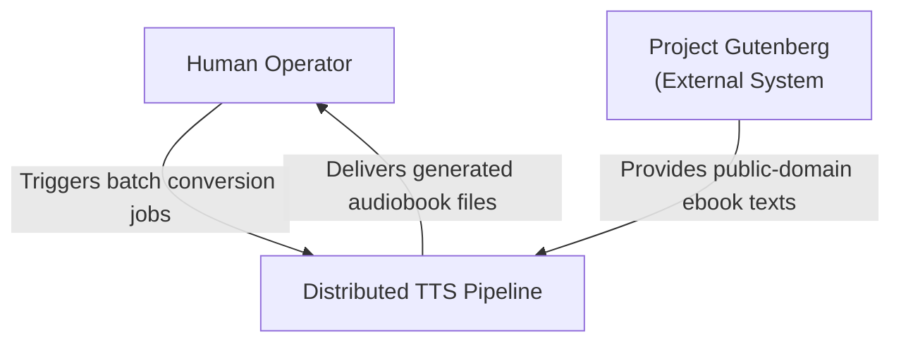
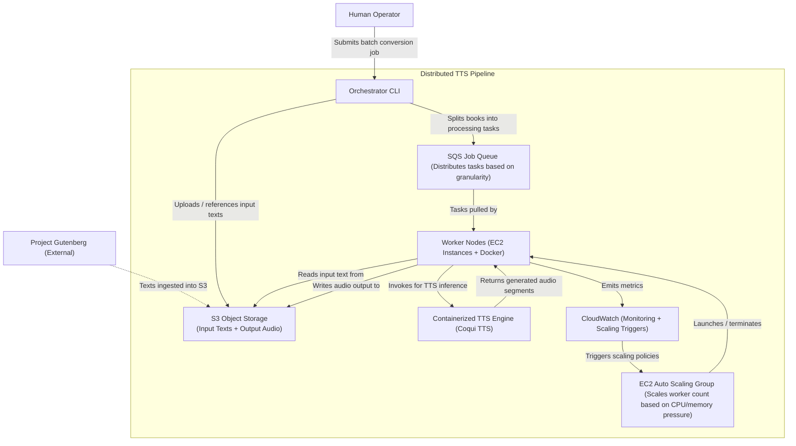

# Architecture Document: Distributed TTS Pipeline

## Table of Contents

- [Project Overview](#project-overview)
- [Problem Statement](#problem-statement)
- [Architecture Diagrams](#architecture-diagrams)
  - [C1 — System Context Diagram](#c1--system-context-diagram)
  - [C2 — Container Diagram](#c2--container-diagram)
- [Component Descriptions](#component-descriptions)
  - [Human Operator](#human-operator)
  - [Project Gutenberg](#project-gutenberg)
  - [Orchestrator CLI](#orchestrator-cli)
  - [S3 Object Storage](#s3-object-storage)
  - [SQS Job Queue](#sqs-job-queue)
  - [Worker Nodes](#worker-nodes)
  - [Containerized TTS Engine](#containerized-tts-engine)
  - [EC2 Auto Scaling Group](#ec2-auto-scaling-group)
  - [CloudWatch](#cloudwatch)
- [Data Flow](#data-flow)
- [Workload Granularity](#workload-granularity)
- [Fault Tolerance and Recovery](#fault-tolerance-and-recovery)
- [Autoscaling Strategy](#autoscaling-strategy)
- [Technology Stack](#technology-stack)
- [Open Questions](#open-questions)

---

## Project Overview

This project implements a **cloud-native, distributed text-to-speech (TTS) pipeline** capable of converting a large corpus of public-domain books (e.g., Project Gutenberg's 75,000+ titles) into audiobooks using parallel execution across multiple compute nodes.

The system does **not** aim to build a new TTS model. Instead, it focuses on designing a **scalable, fault-tolerant architecture** that leverages cloud infrastructure for distributed processing, horizontal/vertical scaling, and resilient job execution.

There is **no frontend component**. This project focuses entirely on backend distributed execution.

## Problem Statement

> "How can we design a scalable, fault-tolerant, cloud-native distributed system that can process a large volume of public-domain books into audiobooks utilizing parallel processing across many machines?"

Sequential processing of 75,000+ books on a single machine could take months or years. TTS inference — especially with hardware-accelerated (GPU) models — is computationally expensive. Existing open-source TTS tools (Coqui TTS, Qwen3-TTS, etc.) are typically designed for single-machine use and prioritize model quality or UI design over scalability.

## Architecture Diagrams

These diagrams follow the [C4 model](https://c4model.com/diagrams) for visualizing software architecture.

### C1 — System Context Diagram

The highest-level view. The entire system is represented as a single box, showing the external actors and systems that interact with it.

**Summary:** A human operator triggers batch conversion jobs against the Distributed TTS Pipeline. The pipeline ingests public-domain texts from Project Gutenberg and produces audiobook files that the operator can retrieve.

### C2 — Container Diagram

Zooms into the Distributed TTS Pipeline to show its major technical building blocks (containers in the C4 sense — separately deployable/runnable units).

**Summary:** The operator submits a batch job via the Orchestrator CLI. The CLI splits books into tasks and enqueues them in SQS. Worker nodes (EC2 + Docker) pull tasks, read text from S3, invoke the containerized TTS engine, and write audio back to S3. CloudWatch monitors worker metrics and triggers the Auto Scaling Group to scale.

---

## Component Descriptions

### Human Operator

- **Role:** Individual who initiates batch conversion jobs.
- **Interaction:** Submits jobs to the Orchestrator CLI. Retrieves generated audiobooks from S3.
- The operator manually triggers jobs (cloud have automated/scheduled trigger).

### Project Gutenberg

- **Role:** External source of public-domain ebook texts.
- **Data:** 75,000+ books in plain text format.
- **Interaction:** Texts are ingested into S3. The exact ingestion mechanism is an [open question](#open-questions).

### Orchestrator CLI

- **Role:** The operator-facing entry point to the pipeline.
- **Responsibilities:**
  - Accepts batch job submissions from the operator.
  - Splits books into processing tasks at the configured granularity (per-book, per-chapter, or per-chunk).
  - Enqueues tasks into the SQS job queue.
  - Uploads or references input texts in S3.
- **Technology:** Python script or lightweight service.

### S3 Object Storage

- **Role:** Centralized, durable storage for both input and output data.
- **Contents:**
  - **Input:** Raw text files (books from Gutenberg).
  - **Output:** Generated audio files (audiobooks or audio segments).
- **Design rationale:** Using cloud object storage keeps all worker nodes **stateless**. Workers don't need local copies of the full corpus — they read what they need from S3 per task and write results back.

### SQS Job Queue

- **Role:** Distributes processing tasks to the worker fleet.
- **Task granularity options:**
  - Per book (one task = one entire book)
  - Per chapter (one task = one chapter within a book)
  - Per chunk (one task = a fixed-size text segment within a chapter)
- **Design rationale:** Decouples the orchestrator from the workers. Workers pull tasks at their own pace, enabling natural load balancing. SQS provides built-in message visibility timeouts and dead-letter queues for fault tolerance.

### Worker Nodes

- **Role:** The compute backbone of the pipeline.
- **Infrastructure:** EC2 instances managed by an Auto Scaling Group, each running Docker.
- **Behavior per task:**
  1. Pull a task message from SQS.
  2. Read the corresponding input text from S3.
  3. Invoke the containerized TTS engine to synthesize audio.
  4. Write the generated audio back to S3.
  5. Delete the task message from SQS (acknowledge completion).
- **Stateless:** Workers hold no persistent state. All data flows through S3 and SQS.

### Containerized TTS Engine

- **Role:** Performs the actual text-to-speech inference.
- **Technology:** Coqui TTS running in a Docker container on each worker node.
- **Design rationale:** Containerization ensures consistent, reproducible environments across all workers. LLM-based TTS engines are explicitly excluded due to their additional compute overhead, which would reduce throughput.

### EC2 Auto Scaling Group

- **Role:** Manages the size of the worker fleet dynamically.
- **Scaling triggers:** CPU pressure and memory pressure on running workers (monitored via CloudWatch).
- **Behavior:** Launches new worker instances when demand is high, terminates them when demand drops.

### CloudWatch

- **Role:** Monitoring and observability.
- **Responsibilities:**
  - Collects metrics from worker nodes (CPU utilization, memory usage, etc.).
  - Triggers Auto Scaling Group scaling policies based on configured thresholds.
  - Provides basic operational visibility into pipeline health.
- **Scope:** Minimal/baseline monitoring. May be expanded later.

---

## Data Flow

A step-by-step walkthrough of how a batch job moves through the system:

1. **Job Submission:** The human operator submits a batch conversion job via the Orchestrator CLI, specifying which books to process and at what granularity.
2. **Task Splitting:** The CLI splits the job into individual tasks (e.g., one task per chapter) and enqueues them into the SQS job queue. Input texts are uploaded to (or already present in) S3.
3. **Task Distribution:** Worker nodes continuously poll the SQS queue. Each worker pulls one task at a time.
4. **Text Retrieval:** The worker reads the corresponding text segment from S3.
5. **TTS Inference:** The worker passes the text to the containerized Coqui TTS engine, which generates an audio segment.
6. **Audio Storage:** The worker writes the generated audio file back to S3, organized by book/chapter/chunk.
7. **Task Acknowledgment:** The worker deletes the task message from SQS, signaling successful completion.
8. **Repeat:** The worker immediately polls for the next task. This continues until the queue is empty.
9. **Scaling:** Throughout this process, CloudWatch monitors worker metrics and triggers the Auto Scaling Group to add or remove workers as needed.

---

## Workload Granularity

The pipeline supports three levels of task granularity, which is a key variable for performance evaluation:

| Granularity | Task Unit | Trade-offs |
|---|---|---|
| **Per book** | One task = one entire book | Simplest. Large task size means fewer messages but longer per-task processing time. A single failure loses more work. |
| **Per chapter** | One task = one chapter | Good balance. Moderate message count. Failures lose only one chapter. Natural unit for audiobook structure. |
| **Per chunk** | One task = fixed-size text segment | Most granular. Maximizes parallelism and load balancing. Requires post-processing to stitch audio segments. Highest message overhead. |

**This is just an idea, it might be interesing to not just see how the pipeline works across different amounts of CPU/GPU's but also the actual granularity of parsing**

---

---

## Autoscaling Strategy

- **Metric-driven:** Scaling decisions are based on CloudWatch metrics (CPU/GPU utilization and memory pressure across the worker fleet).
- **Scale-out:** When average CPU/GPU utilization exceeds a threshold (e.g., 70%), the ASG launches additional EC2 instances.
- **Scale-in:** When utilization drops below a lower threshold (e.g., 30%), the ASG terminates idle instances.
- **Cooldown periods:** Configured to prevent thrashing (rapid scale-out followed by immediate scale-in).
- **Evaluation goal:** The project will validate that elastic scaling works correctly under varying loads and measure how scaling affects throughput and cost.

---

## Technology Stack

| Layer | Technology | Purpose |
|---|---|---|
| Cloud Platform | AWS | Infrastructure provider |
| Object Storage | Amazon S3 | Input text and output audio storage |
| Job Queue | Amazon SQS | Task distribution to workers |
| Compute | Amazon EC2 (Auto Scaling Group) | Worker node infrastructure |
| Container Runtime | Docker | Runs TTS engine on each worker |
| TTS Engine | Coqui TTS | Text-to-speech inference |
| Monitoring | Amazon CloudWatch | Metrics, alarms, and scaling triggers |
| Orchestrator | Python (CLI) | Job submission and task splitting |

---

## Open Questions

### 1. Ingestion Mechanism
**Question:** How do texts get from Project Gutenberg into S3?
- Option A: The Orchestrator CLI downloads books from Gutenberg and uploads them to S3 as part of job submission.
- Option B: A separate, one-time bulk import script downloads the entire Gutenberg corpus into S3 beforehand.
- Option C: A dedicated ingestion service that can be run independently.
- **Status:** TBD.

### 2. Result Delivery / Notification
**Question:** How does the operator know when a batch job is complete, and how do they retrieve results?
- Option A: The operator manually checks S3 for output files.
- Option B: The Orchestrator tracks job progress (e.g., via a DynamoDB table tracking task completion) and notifies the operator.
- Option C: A simple SNS notification when all tasks for a job are processed.
- **Status:** TBD.

### 3. Single Queue vs. Multiple Queues
**Question:** Should there be one SQS queue for all tasks, or separate queues for different granularity levels?
- Single queue is simpler but mixes task types.
- Multiple queues allow different scaling/priority behavior per granularity.
- **Status:** TBD.

### 4. GPU vs. CPU Workers
**Question:** What is the cost-performance trade-off between CPU-only and GPU-accelerated workers?
- The project plans to empirically evaluate this, but the initial architecture should support both instance types.
- **Status:** TBD.

### 5. Audio Stitching for Chunk-Level Granularity
**Question:** When processing at per-chunk granularity, how are individual audio segments stitched back into a coherent audiobook?
- Needs a post-processing step to concatenate audio segments in order.
- **Status:** TBD, depends on which granularity levels are implemented.
